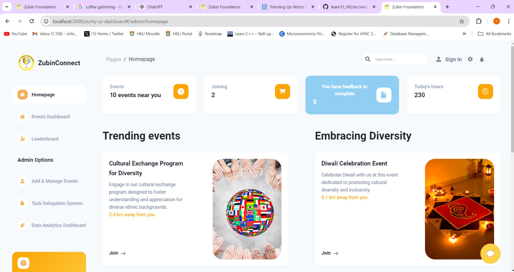
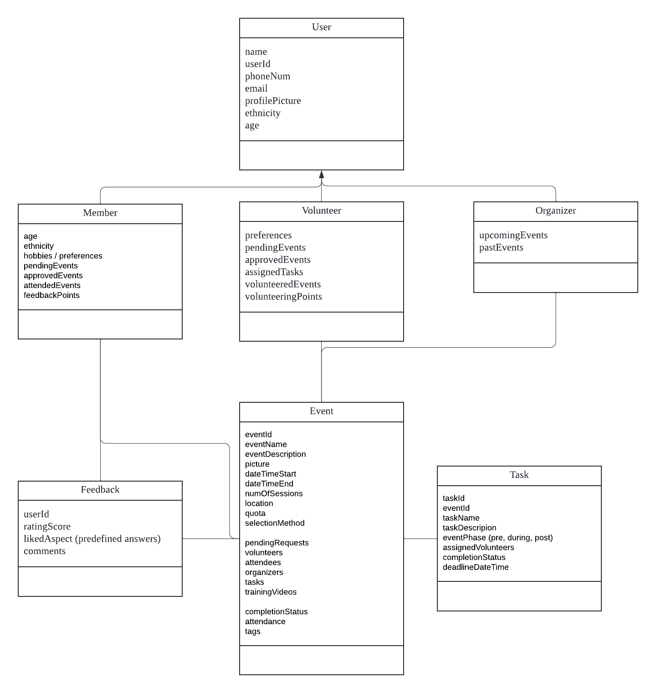

# [ZubinConnect]()



**Zubin Connect Platform**

Welcome to Zubin Connect Platform, a tool designed to help you manage and organize events seamlessly.
About The Zubin Foundation
The Zubin Foundation is a tribute to little Zubin, a child who tragically passed away due to medical negligence at the tender age of 3 in 2009. Founded by Shalini Mahtani and Ravi Gidumal, Zubin's parents, the foundation embodies the essence of serving and honoring through its work.

**Vision**

The core vision of The Zubin Foundation is to enhance the quality of life for Hong Kong's ethnic minorities by alleviating suffering and fostering opportunities. This mission is achieved through proactive outreach efforts and advocating for systemic changes.

**Documentation built by Developers**

Each element is well presented in a very complex documentation.

**Class Diagram**




#### Special thanks

During the development of this dashboard, we have used many existing resources from awesome developers. We want to thank them for providing their tools open source:

- [Zubin Foundation](https://www.zubinfoundation.org) - NGO
- [Chakra UI](https://www.chakra-ui.com?ref=creative-tim) - Open source ReactJS framework
- [ReactJS](https://reactjs.org?ref=creative-tim) - A popular JavaScript library for building user interfaces

Let us know your thoughts below. And good luck with development!

## Table of Contents

- [Quick start](#quick-start)
- [File Structure](#file-structure)
- [Browser Support](#browser-support)
- [Reporting Issues](#reporting-issues)
- [Licensing](#licensing)

## Quick Start

- Clone the repo: `git clone https://github.com/ak7660/team13_MS`.
- `cd team13_MS`
- `npm install -g npm@9.6.3`
- `npm install`
- `npm start`

## File Structure

Within the download you'll find the following directories and files:

```
team13_MS/
├── .gitattributes
├── .gitigonore
├── CHANGELOG.md
├── commit.sh
├── gulpfile.js
├── ISSUE_TEMPLATE.md
├── jsconfig.json
├── package-lock.json
├── package.json
├── README.md
├── documentation
├── node_modules
├── public
│   ├── favicon.ico
│   ├── index.html
│   └── manifest.json
└── src
    ├── assets
    │   ├── img
    │   └── svg
    ├── components
    │   ├── Card
    │   │   ├── Card.js
    │   │   ├── CardBody.js
    │   │   └── CardHeader.js
    │   ├── Charts
    │   │   ├── BarChart.js
    │   │   └── LineChart.js
    │   ├── Configurator
    │   │   └── Configurator.js
    │   ├── FixedPlugin
    │   │   └── FixedPlugin.js
    │   ├── Footer
    │   │   └── Footer.js
    │   ├── Icons
    │   │   ├── IconBox.js
    │   │   └── Icons.js
    │   ├── Layout
    │   │   ├── MainPanel.js
    │   │   ├── PanelContainer.js
    │   │   └── PanelContent.js
    │   ├── Menu
    │   │   └── ItemContent.js
    │   ├── Navbars
    │   │   ├── Searchbar
    │   │   │   └── SearchBar.js
    │   │   ├── AdminNavbar.js
    │   │   ├── AdminNavbarLinks.js
    │   │   └── AuthNavbar.js
    │   ├── Other
    │   │   ├── BillingRow.js
    │   │   ├── InvoicesRow.js
    │   │   └── TransactionRow.js
    │   ├── Separator
    │   │   └── Separator.js
    │   ├── Sidebar
    │   │   ├── Sidebar.js
    │   │   └── SidebarHelp.js
    │   └── Tables
    │       ├── BillingRow.js
    │       ├── DashboardTableRow.js
    │       ├── InvoicesRow.js
    │       ├── TablesProjectRow.js
    │       ├── TablesTableRow.js
    │       ├── TimelineRow.js
    │       └── TransactionRow.js
    ├── layouts
    │   ├── Admin.js
    │   ├── Auth.js
    │   └── RTL.js
    ├── theme
    │   ├── additions
    │   │   ├── card
    │   │   │   ├── Card.js
    │   │   │   ├── CardBody.js
    │   │   │   └── CardHeader.js
    │   │   ├── layout
    │   │   │   ├── MainPanel.js
    │   │   │   ├── PanelContainer.js
    │   │   │   └── PanelContent.js
    │   ├── components
    │   │   ├── button.js
    │   │   ├── link.js
    │   │   └── drawer.js
    │   ├── foundations
    │   │   ├── breakpoints.js
    │   │   └── text.js
    │   ├── styles.js
    │   └── theme.js
    ├── variables
    │   ├── charts.js
    │   └── general.js
    ├── views
    │   ├── Dashboard
    │   │   ├── Billing.js
    │   │   ├── Dashboard.js
    │   │   ├── Profile.js
    │   │   └── Tables.js
    │   ├── Pages
    │       ├── SignIn.js
    │       └── SignUp.js
    │   └── RTL
    │       └── RTLPage.js
    ├── index.js
    └── routes.js

```


## Licensing

- MIT
